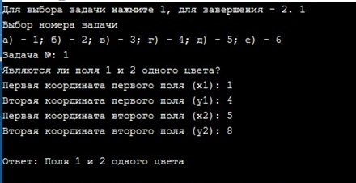

# Chess

### Описание назначения
Поле шахматной доски определяется парой натуральных чисел, каждое из которых не превосходит восьми: первое число— номер вертикали (при счете слева направо), второе — номер горизонтали (при счете снизу вверх). Пользователь выбирает номер задачи, задает координаты двух полей, программа выдает полученный результат.
При введении неверной координаты программа выдает сообщение об ошибке
 - Ввод неверных координат.

### Запуск программы
Программа реализована на языке С++, написана посредством Microsoft Visual Studio 2019. Для открытия используется файл 'Chess.txt'

### Задача а)
Выяснить, являются ли поля (х1, у1) и (х2, у2) полями одного цвета.

### Задача б)
На поле (х1, у1) расположен ферзь. Угрожает ли он полю (х2, у2)?
 - Пример решения задачи б).

### Задача в)
На поле (х1, у1) расположен конь. Угрожает ли он полю (х2, у2)?
 - Пример решения задачи в).

### Задача г)
Выяснить, можно ли с поля (х1, у1) одним ходом ладьи попасть на поле (х2, у2). Если нет, то выяснить, как это можно сделать за два хода (указать поле, на которое приводит первый ход).
 - Пример решения задачи г).

### Задача д)
Выяснить, можно ли с поля (х1, у1) одним ходом ферзя попасть на поле (х2, у2). Если нет, то выяснить, как это можно сделать за два хода (указать поле, на которое приводит первый ход).
 - Пример решения задачи д).

### Задача е)
е) Выяснить, можно ли с поля (х1, у1) одним ходом слона попасть на поле (х2, у2). Если нет, то выяснить, как это можно сделать за два хода (указать поле, на которое приводит первый ход)
 - Пример решения задачи е).

